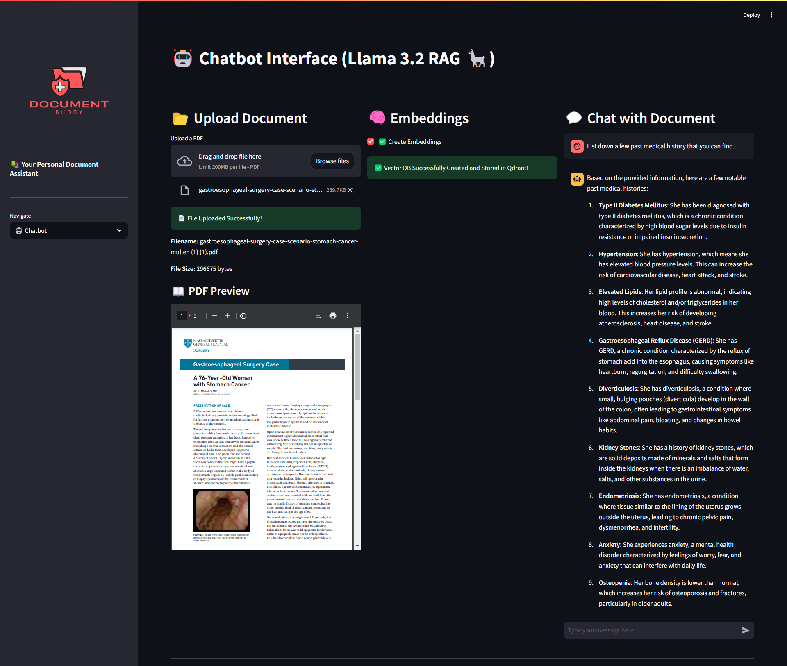

# RAG-Based LLM AI Chatbot 🤖


A Retrieval-Augmented Generation (RAG) based AI chatbot that allows users to upload PDF documents and interact with them using natural language.

The application combines **Large Language Models, semantic search, vector databases, and document processing** to provide context-aware answers based on uploaded documents.

## 🚀 Features

- 📂 **PDF Document Upload**
  - Upload PDF documents directly through the application.
  - Process documents for question answering.

- 🧠 **Document Embeddings**
  - Convert document content into vector embeddings.
  - Use semantic similarity for document retrieval.

- 🔎 **Semantic Search**
  - Retrieve the most relevant sections of uploaded documents.
  - Use Qdrant as the vector database for similarity search.

- 🤖 **AI Chatbot**
  - Ask questions about uploaded documents using natural language.
  - Generate context-aware responses using a locally running LLaMA model.

- 🔒 **Local AI Stack**
  - Run the LLM and vector database locally.
  - No external LLM API is required for generating responses.

- 🖥️ **Streamlit Interface**
  - Interactive web interface for uploading documents and chatting with them.

---

## 🛠️ Tech Stack

| Technology | Purpose |
|------------|---------|
| Python | Core application development |
| Streamlit | Web application interface |
| LangChain | RAG pipeline and LLM orchestration |
| LLaMA 3.2 | Local Large Language Model |
| Ollama | Local LLM execution |
| BGE Embeddings | Document embedding generation |
| Qdrant | Vector database |
| Unstructured | PDF document processing |
| Docker | Running Qdrant locally |

---

## 🏗️ How It Works

The application follows a Retrieval-Augmented Generation pipeline:

```text
                PDF Document
                     │
                     ▼
            Document Processing
                     │
                     ▼
             Text Extraction
                     │
                     ▼
              Text Chunking
                     │
                     ▼
            BGE Embeddings
                     │
                     ▼
              Qdrant Vector DB
                     │
                     │
              User Question
                     │
                     ▼
             Semantic Search
                     │
                     ▼
          Relevant Document Chunks
                     │
                     ▼
              LLaMA 3.2
                     │
                     ▼
             Generated Answer
```

The system retrieves relevant information from uploaded documents before sending the context to the LLM. This allows the chatbot to answer questions using the contents of the user's documents rather than relying only on the model's pretrained knowledge.

---

## 📁 Project Structure

```text
RAG-Based-LLM-Chatbot/
│
├── aliases/
│   └── data.json
│
├── chatbot.py
├── new.py
├── vectors.py
├── requirements.txt
├── README.md
├── .gitignore
├── raft_state.json
├── sct.png
├── Check PDF LLM Fine tuning.pdf
└── temp.pdf
```

### Main Files

**`new.py`**

Main Streamlit application responsible for the user interface and application flow.

**`vectors.py`**

Handles document processing, chunking, embedding generation, and interaction with the Qdrant vector database.

**`chatbot.py`**

Handles the chatbot and RAG logic and communication with the local LLaMA model.

**`requirements.txt`**

Contains the Python dependencies required to run the project.

---

## ⚙️ Prerequisites

Before running the project, make sure you have the following installed:

- Python 3.10+
- Docker
- Ollama
- Git

You will also need the required LLaMA model available through Ollama.

---

## 🚀 Installation

### 1. Clone the Repository

```bash
git clone https://github.com/rekhchand-01/RAG-Based-LLM-Chatbot.git
cd RAG-Based-LLM-Chatbot
```

### 2. Create a Virtual Environment

#### Windows

```bash
python -m venv .venv
.venv\Scripts\activate
```

#### macOS / Linux

```bash
python3 -m venv .venv
source .venv/bin/activate
```

### 3. Install Dependencies

```bash
pip install -r requirements.txt
```

---

## 🐳 Run Qdrant

The project uses Qdrant as a local vector database.

Start Qdrant using Docker:

```bash
docker run -p 6333:6333 qdrant/qdrant
```

Qdrant will then be available locally at:

```text
http://localhost:6333
```

---

## 🦙 Setup Ollama

Install Ollama and download the required LLaMA model:

```bash
ollama pull llama3.2
```

Make sure Ollama is running before starting the chatbot.

You can verify the model using:

```bash
ollama list
```

---

## ▶️ Run the Application

Start the Streamlit application:

```bash
streamlit run new.py
```

The application will be available at:

```text
http://localhost:8501
```

Open the URL in your browser if Streamlit does not open it automatically.

---

## 💬 Using the Chatbot

1. Start the Qdrant Docker container.
2. Start Ollama and make sure the LLaMA model is available.
3. Run the Streamlit application.
4. Upload a PDF document.
5. Generate/process the document embeddings.
6. Ask questions about the uploaded document.
7. The RAG pipeline retrieves relevant document sections.
8. The retrieved context is provided to the LLaMA model.
9. The chatbot generates an answer based on the retrieved information.

---

## 🔍 RAG Pipeline

The project implements the following RAG workflow:

### 1. Document Ingestion

PDF files are uploaded through the Streamlit interface and processed using the document processing pipeline.

### 2. Text Extraction and Chunking

The extracted document text is divided into smaller chunks to make retrieval more effective.

### 3. Embedding Generation

Each chunk is converted into a numerical vector using the **BGE embedding model**.

### 4. Vector Storage

The generated embeddings are stored in **Qdrant**, allowing the system to perform efficient similarity searches.

### 5. Retrieval

When a user asks a question, the question is converted into an embedding and compared against the stored document vectors.

### 6. Context Generation

The most relevant document chunks are retrieved and provided as context to the LLaMA model.

### 7. Response Generation

LLaMA 3.2 generates the final response using the retrieved document context.

---

## 🧩 Key Concepts Demonstrated

This project demonstrates practical implementation of:

- Retrieval-Augmented Generation (RAG)
- Large Language Models (LLMs)
- Semantic Search
- Vector Embeddings
- Vector Databases
- Document Question Answering
- Local LLM Deployment
- LangChain
- Qdrant
- Ollama
- Docker
- Streamlit
- PDF Processing

---

## 🔮 Future Improvements

Some possible improvements include:

- Support for multiple document formats.
- Conversation memory for multi-turn conversations.
- Improved document chunking strategies.
- Source citations for retrieved document sections.
- Better document management and deletion.
- Authentication and user-specific document collections.
- Advanced RAG evaluation.
- Modern React-based frontend.
- Cloud deployment.

---

## 📌 Project Status

The project is currently functional as a local RAG-based document chatbot using:

**Streamlit + LangChain + BGE Embeddings + Qdrant + Ollama + LLaMA 3.2**

Further improvements can focus on UI modernization, RAG quality, document management, and deployment.

---

## ⭐ About

This project was built to explore the practical implementation of **Retrieval-Augmented Generation (RAG)** using an open-source AI stack and locally running infrastructure.
